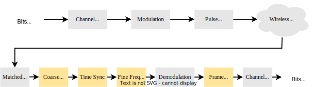

## Simulating-Wireless-Channel

### Моделируемая схема беспроводного канала


В данном проекте осуществляется моделирвоание беспроводного канала.

1. В качестве входных данных используется рандомный набор бит.
2. К входным данным добавляется преамбула в виде кода Баркера.
3. В качестве модуляции используется BPSK.
4. Для формирования импульсов используется фильтр приподнятого косинуса.
5. Для моделирования канала применяются следующие искажения:
- Фильтр дробной задержки (задержка по времени);
- Смещение частоты;
6. В качестве грубой синхронизации по частоте используется возведение сигнала в квадрат.
7. Для временной синхронизации используется метод Мюллера.
8. Для точной синхронизации по частоте используется петля Костаса.

## Модель канала - [Wireless-Channel](./Simulating-Wireless-Channel.ipynb)

### Install requirements:
```bash
pip install -r requirements.txt
```
Requirements:
```bash
ipython==8.7.0
matplotlib==3.6.2
numpy==1.23.5
scipy==1.9.3
```

Проект выполнен согласно [pysdr.org](https://pysdr.org/content/sync.html)
